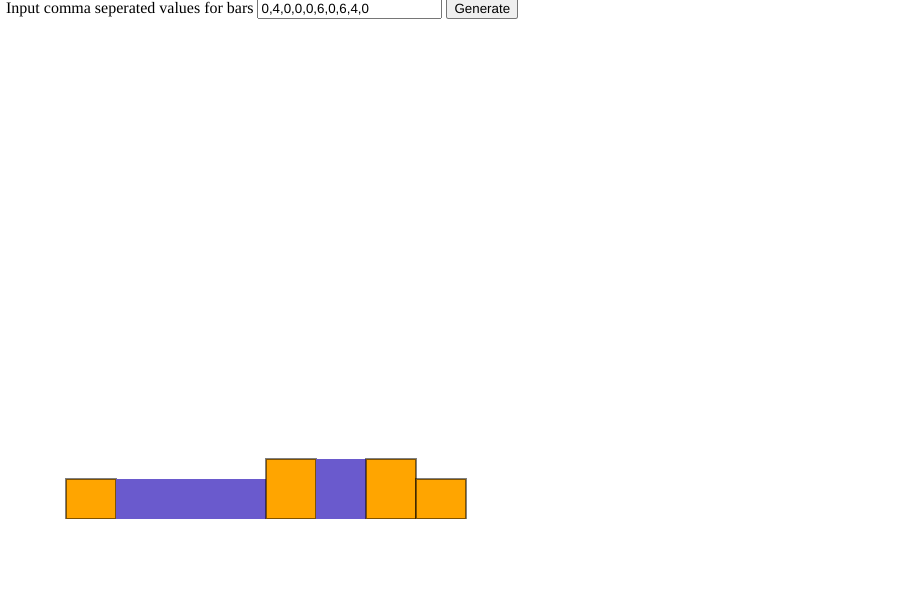

## How to use
1. Open index.html
2. Input comma seperated values in the input and click on generate
3. It will generate a svg file with bars and water answer in a node with id diagram.
4. Water is encoded in green and bars are encoded in yellow
